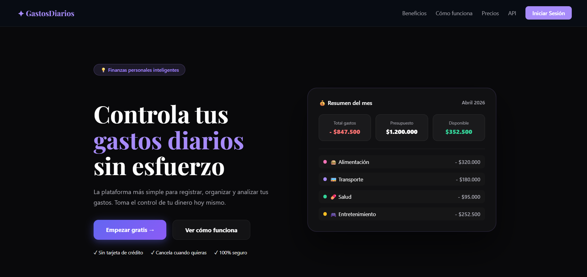
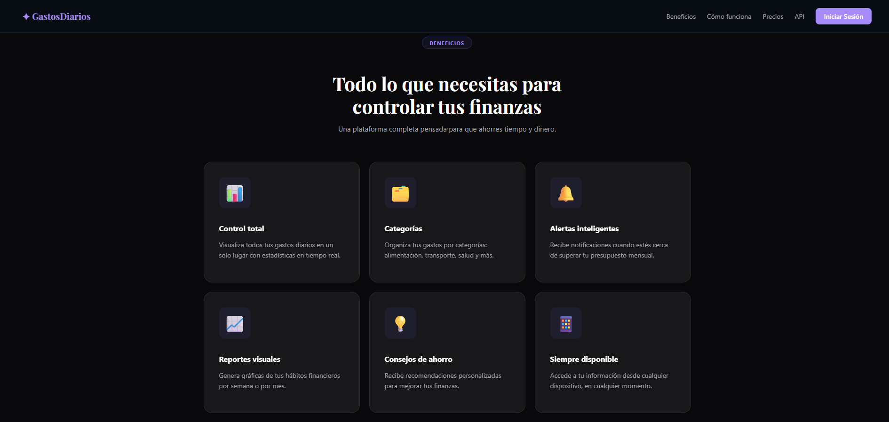
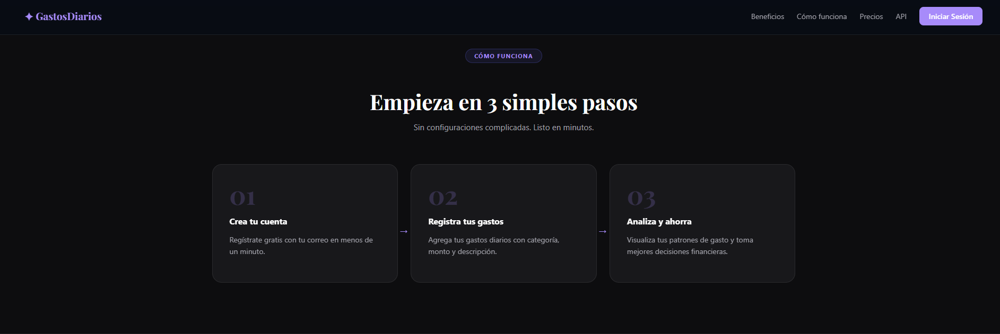
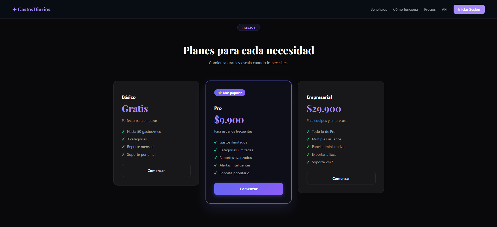
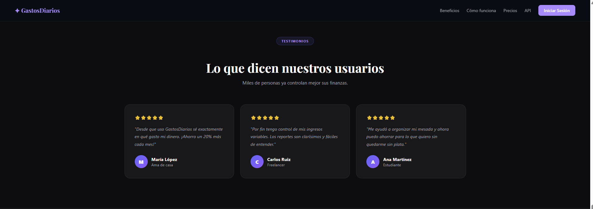
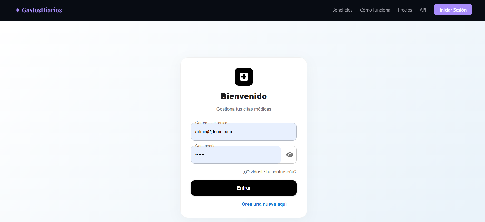
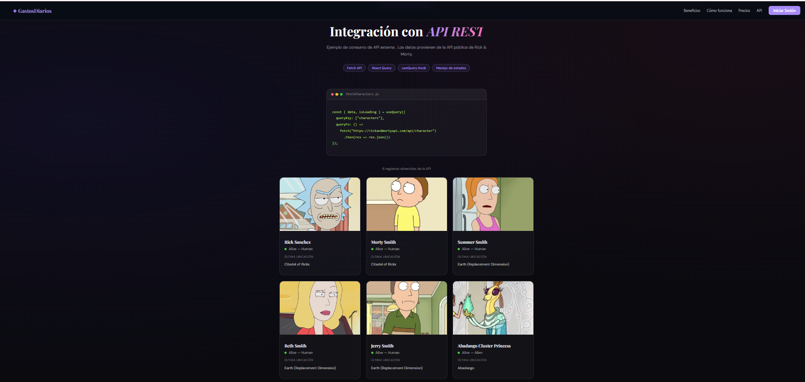

#  GastosDiarios — Gestión de Citas Médicas

## Descripción
GastosDiarios es una aplicación web que combina una landing page de finanzas personales con un sistema de gestión de citas médicas. Desarrollada como proyecto integrador entre los módulos de Frontend y Backend del SENA, permite a los usuarios registrarse, iniciar sesión y gestionar sus citas médicas de forma segura. Incluye consumo de API externa, autenticación con JWT y una interfaz moderna y responsive.

---

##  Características principales

- **Landing Page** de finanzas personales con secciones: Inicio, Beneficios, Cómo funciona, Precios y Testimonios
-  **Autenticación segura** con JWT — Login, Registro y Cierre de sesión
-  **Gestión de Citas Médicas** — CRUD completo (Crear, Listar, Editar y Eliminar)
-  **Consumo de API externa** — Rick & Morty API con React Query y Fetch
-  **Diseño responsive** adaptado a móviles y escritorio
-  **Recuperación de contraseña** (solo formulario)
-  **Rutas protegidas** — solo accesibles después del login
-  **Caché inteligente** con TanStack React Query

---

## Instalación

### 1. Clona el repositorio
```bash
git clone https://github.com/sofiagonzalezortiz13/frontend.git
cd frontend
```

### 2. Instala las dependencias
```bash
npm install
```

### 3. Crea el archivo de variables de entorno
Crea un archivo `.env` en la raíz del proyecto:
```env
VITE_API_URL=https://backend-1-ct66.onrender.com
```


## Ejecución

### Modo desarrollo
```bash
npm run dev
```
Abre tu navegador en: `http://localhost:5173`

### Modo producción
```bash
npm run build
npm run preview
```

---

##  Tecnologías utilizadas

| Tecnología | Uso |
|---|---|
| React 18 | Librería principal de UI |
| Vite | Bundler y servidor de desarrollo |
| React Router DOM | Enrutamiento SPA |
| TanStack React Query | Manejo de estado y caché |
| Axios | Cliente HTTP con interceptores JWT |
| CSS personalizado | Estilos por componente |
| Rick & Morty API | API externa consumida con Fetch |
| Google Fonts | Tipografías Playfair Display y DM Sans |

---

## Arquitectura / Encarpetado
src/
├── features/
│   ├── auth/
│   │   ├── api/
│   │   │   └── axios.js              # Configuración Axios + interceptores JWT
│   │   ├── components/
│   │   │   ├── citaForm.jsx          # Formulario crear/editar cita médica
│   │   │   ├── citaItem.jsx          # Componente individual de cita
│   │   │   ├── citaList.jsx          # Lista de citas médicas
│   │   │   ├── Myaccount.jsx         # Perfil de usuario
│   │   │   └── portal.jsx            # Portal de autenticación (Login)
│   │   ├── context/
│   │   │   └── AuthContext.jsx       # Contexto global de autenticación JWT
│   │   └── services/
│   │       ├── auth.service.js       # Servicios de autenticación
│   │       └── cita.service.js       # Servicios de citas médicas
│   └── layout/
│       ├── ApiRyC.jsx                # Consumo API externa Rick & Morty
│       ├── ApiRyC.css                # Estilos del demo API
│       ├── Content.jsx               # Contenido principal Landing Page
│       ├── content.css               # Estilos del contenido
│       ├── Footer.jsx                # Pie de página
│       ├── footer.css                # Estilos del footer
│       ├── Header.jsx                # Navbar principal
│       ├── header.css                # Estilos del navbar
│       └── LandingPage.css           # Estilos generales landing
├── shared/
│   ├── components/                   # Componentes reutilizables
│   └── styles.css                    # Estilos compartidos
├── theme/
│   └── AppTheme.js                   # Tema global
├── App.jsx                           # Componente raíz
├── AppRoutes.jsx                     # Definición de rutas
├── main.jsx                          # Punto de entrada
└── index.css                         # Reset CSS


---

##  Screenshots de la interfaz

### Landing Page — Inicio


### Landing Page — Beneficios


### Landing Page — Como Funciona


### Landing Page — Precios


### Landing Page — Testimonios


### Login — Portal de acceso


### API Externa — Rick & Morty



## Repositorio

[https://github.com/sofiagonzalezortiz13/frontend](https://github.com/sofiagonzalezortiz13/frontend)


##  Deploy

[https://frontend-kappa-two-30.vercel.app/](https://frontend-kappa-two-30.vercel.app/)

---

##  Datos del Autor

| **Nombre completo** | Sofía González Ortiz |
| **Ficha** | 3256502 |
| **Programa** | Análisis y Desarrollo de Software |
| **GitHub** | [@sofiagonzalezortiz13](https://github.com/sofiagonzalezortiz13) |
| **Deploy** | [Ver aplicación](https://frontend-kappa-two-30.vercel.app/) |
